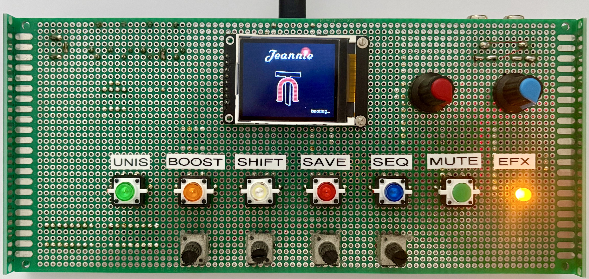
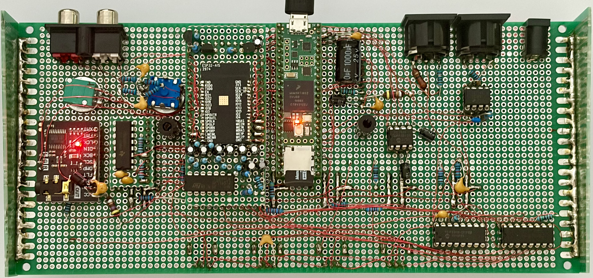
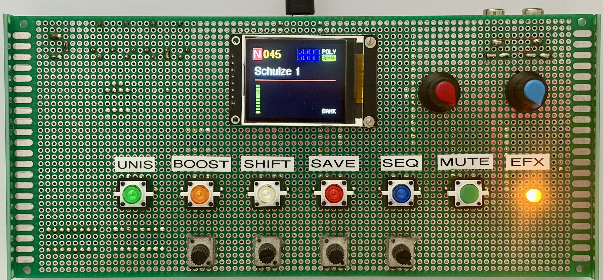
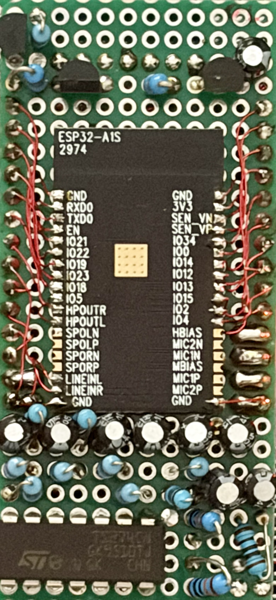
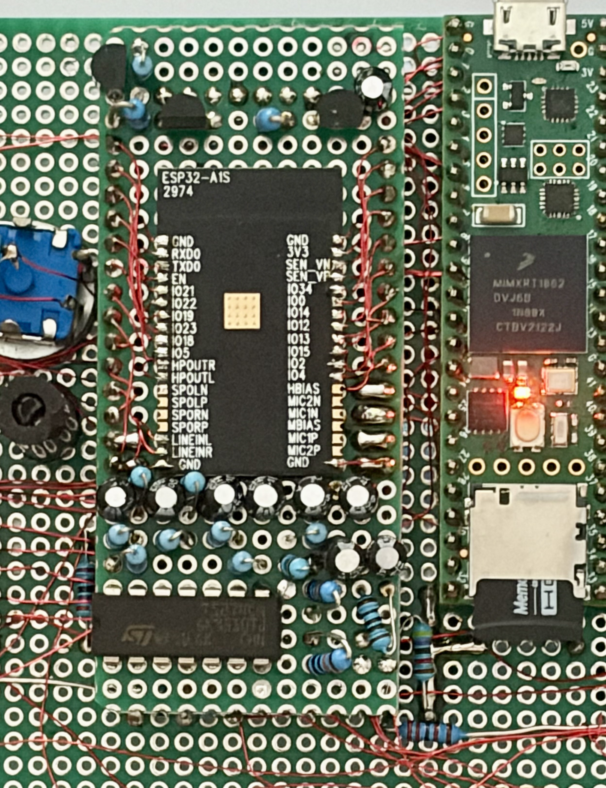
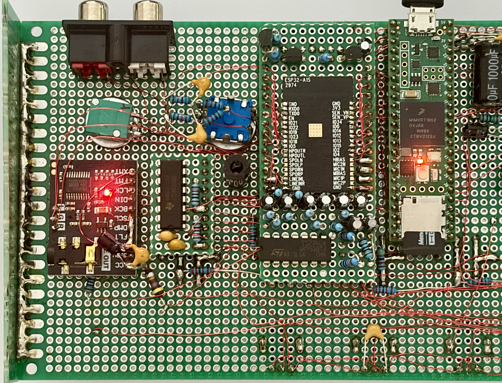
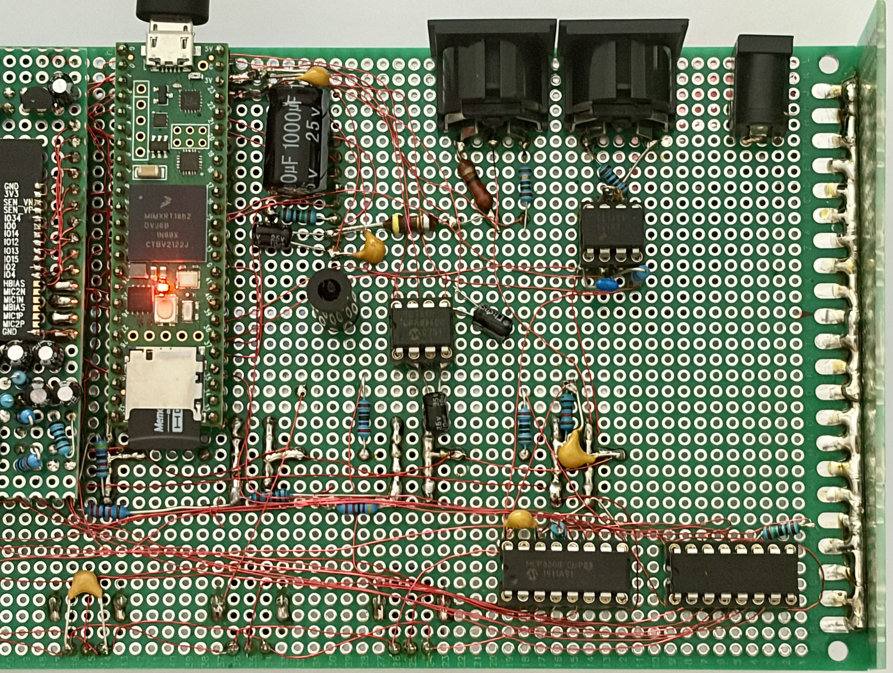

# RTAL-EST-001 – ESP32 DSP for the TubeOhm Jeannie

## Engineering Study

*Respecting an outstanding synthesizer design while exploring new possibilities in embedded digital signal processing.*



*Image 1: TubeOhm Jeannie Perfboard with Wrapping Wire Top View



*Image 2: TubeOhm Jeannie Perfboard with Wrapping Wire Buttom View

---

## About this Repository

This repository documents an engineering modification of the **TubeOhm Jeannie** synthesizer.

The original Jeannie synthesizer was designed by **Rolf Degen / TubeOhm Instruments**. The synthesizer architecture, original hardware, original firmware and original project documentation belong to the Jeannie project.

This repository does **not** claim the Jeannie synthesizer as an original RTAL development.

Instead, it documents my personal build and the integration of a custom **ESP32-based stereo effects processor**, which replaces the original **Spin FV-1 effects board** in my own instrument.

The project is published as part of the **RTAL Engineering Heritage Collection** as an engineering study in respectful acknowledgement of the original work by Rolf Degen and the open-source embedded audio work by Marcel Licence.

---

## Project Summary

| Item | Description |
|---|---|
| Project ID | RTAL-EST-001 |
| Project Type | Engineering Study / Modification |
| Original Instrument | TubeOhm Jeannie |
| Original Designer | Rolf Degen / TubeOhm Instruments |
| RTAL Contribution | ESP32 effects processor, integration, documentation |
| Construction | Stripboard / Veroboard with point-to-point wiring |
| Effects Platform | ESP32-based DSP board |
| DSP Inspiration / Libraries | Selected effects based on or inspired by Marcel Licence libraries |
| Repository Status | Initial public documentation |

---

## Engineering Story

Every engineer eventually encounters a design that sparks a new idea.

For me, that design was the **TubeOhm Jeannie**.

The Jeannie is a remarkable open-source DIY synthesizer created by **Rolf Degen**. It combines modern digital synthesis, hands-on control, a compact hardware concept and extensive documentation into a very inspiring instrument.

When I decided to build my own Jeannie, I chose a traditional construction method: the complete instrument was built on **stripboard / Veroboard** using manual point-to-point wiring. This was not the easiest approach, but it created a very personal and educational build.

During construction, I also wanted to explore a modification: replacing the original **Spin FV-1** effects processor with a custom **ESP32-based stereo DSP board**.

The intention was not to replace or improve the original Jeannie design. The goal was to learn from it, respect it and explore how modern embedded DSP technology could be integrated into an existing synthesizer architecture.

---

## What this Project Is — and What it Is Not

### This project is:

- A personal engineering study
- A documented Jeannie build using stripboard construction
- A custom ESP32 effects processor integration
- A documentation of hardware, firmware and system integration work
- A respectful tribute to the original Jeannie project

### This project is not:

- The original Jeannie project
- A replacement for Rolf Degen's work
- A commercial Jeannie variant
- A claim of authorship over the original synthesizer design

---

## The Original Jeannie Synthesizer

The **Jeannie** synthesizer was developed by **Rolf Degen** of **TubeOhm Instruments**.

It is one of the most impressive open-source DIY synthesizer projects and demonstrates how a compact embedded system can become a musically useful and technically advanced instrument.

The original project should be regarded as the primary reference for the Jeannie synthesizer.

Suggested links to add:

- TubeOhm Instruments: `https://www.tubeohm.com/`
- Rolf Degen GitHub: `https://github.com/rolfdegen`
- Jeannie Open Source Repository: `https://github.com/rolfdegen/Jeannie-Open-source-Synthesizer`

---

## RTAL Contribution

The RTAL contribution documented here consists of:

- Construction of the Jeannie on stripboard / Veroboard
- Mechanical and electrical integration of the system
- Development of a custom ESP32-based effects processor
- Replacement of the original FV-1 effects board in this build
- Firmware integration and adaptation of DSP effects
- Documentation of the complete engineering process

---

## System Overview

```text
                    TubeOhm Jeannie
                 Original Synthesizer
                    Rolf Degen
                         │
                         │ Audio signal
                         ▼
              Original FV-1 Effects Slot
                         │
                         │ replaced in this build by
                         ▼
              RTAL ESP32 Stereo DSP Board
                         │
        ┌────────────────┼────────────────┐
        │                │                │
      Delay            Reverb           Chorus
      Flanger          Phaser           Stereo FX
        │                │                │
        └────────────────┼────────────────┘
                         ▼
                    Audio Output
```

---

## ESP32 Effects Processor

The ESP32 effects board was developed as a flexible digital effects platform for this Jeannie build.

Planned / implemented effect categories include:

- Stereo delay
- Reverb
- Chorus
- Flanger
- Phaser
- Stereo widening
- Additional experimental DSP algorithms

Some DSP routines are based on or inspired by open-source work by **Marcel Licence** and have been adapted for this project.

---

## Stripboard / Veroboard Construction

One special aspect of this build is the construction method.

Instead of using manufactured PCBs, the synthesizer was built manually using:

- Stripboard / Veroboard
- Point-to-point wiring
- Hand-soldered connections
- Custom wiring harnesses
- Manual mechanical integration

This traditional construction method requires careful planning, patience and systematic testing. It also makes the instrument a unique one-off build.

Suggested image sequence:

```text
images/
├── hero.jpg
├── front_panel.jpg
├── rear_panel.jpg
├── internal_overview.jpg
├── veroboard_top.jpg
├── veroboard_wiring.jpg
├── esp32_fx_board.jpg
└── final_instrument.jpg
```

---

## Repository Structure

```text
RTAL-EST-001-ESP32-DSP-for-Jeannie/
│
├── README.md
├── LICENSE
├── NOTICE.md
├── CREDITS.md
├── CHANGELOG.md
├── CONTRIBUTING.md
├── .gitignore
│
├── docs/
│   ├── HARDWARE.md
│   ├── SOFTWARE.md
│   ├── DSP_ARCHITECTURE.md
│   ├── STRIPBOARD_CONSTRUCTION.md
│   ├── FV1_TO_ESP32.md
│   ├── REFERENCES.md
│   └── LESSONS_LEARNED.md
│
├── engineering_archive/
│   ├── 0001_Project_Idea.md
│   ├── 0002_Why_Jeannie.md
│   ├── 0003_Veroboard.md
│   ├── 0004_ESP32_DSP.md
│   ├── 0005_Final_Integration.md
│   └── BUILD_HISTORY.md
│
├── images/
├── media/
├── schematics/
└── firmware/
```

---

## Engineering Contributions

| Area | Contributor |
|---|---|
| Original Jeannie Synthesizer | Rolf Degen / TubeOhm Instruments |
| Original Jeannie Hardware | Rolf Degen |
| Original Jeannie Firmware | Rolf Degen |
| ESP32 Effects Hardware | RealTimeAudioLab |
| ESP32 Effects Firmware | RealTimeAudioLab |
| System Integration | RealTimeAudioLab |
| Stripboard Construction | RealTimeAudioLab |
| Selected DSP Algorithms / Inspiration | Marcel Licence |
| TFT Graphics Library | Bodmer |
| Touchscreen Library | Paul Stoffregen |
| ESP32 Platform | Espressif Systems |

---

## Documentation Status

This is the initial public documentation version.

Planned additions:

- High-resolution photos
- Complete schematics
- ESP32 firmware
- Audio demos
- Build notes
- Test results
- Signal-flow diagrams
- Detailed DSP documentation

---

## Gallery



*Image 3: TubeOhm Jeannie Perfboard with Wrapping Wire Top View



*Image 4: ESP32A1S EFX Modul 



*Image 5: ESP32A1S EFX Modul 



*Image 6: ESP32A1S EFX Modul 



*Image 7: ESP32A1S EFX Modul 
```
[Watch the demonstration video]
(media/Jeannie_ESP32_DSP_Demo.mp4)
```

---

## Lessons Learned

This project demonstrates several important engineering lessons:

- Existing open-source designs can be extended respectfully.
- Clear attribution is essential when building on the work of others.
- Traditional construction techniques can still be valuable for complex electronic instruments.
- Replacing an effects processor is not only a DSP task; it is also a system integration task.
- Documentation is part of engineering, not an afterthought.

---

## License and Third-Party Notice

This repository contains several different kinds of material:

- Original RTAL documentation and ESP32 integration work
- References to the TubeOhm Jeannie project by Rolf Degen
- DSP routines based on or inspired by Marcel Licence libraries
- Third-party libraries such as TFT_eSPI and XPT2046 Touchscreen

Please see:

- `LICENSE`
- `NOTICE.md`
- `CREDITS.md`

for details.

---

## Credits

Special thanks to:

- **Rolf Degen** for the TubeOhm Jeannie synthesizer
- **Marcel Licence** for his embedded audio work and DSP libraries
- **Bodmer** for TFT_eSPI
- **Paul Stoffregen** for the XPT2046 Touchscreen library
- **Espressif Systems** for the ESP32 platform
- The Arduino and open-source communities

---

## RTAL Engineering Heritage Collection

This repository is part of the **RTAL Engineering Heritage Collection**.

The collection documents original hardware developments, engineering studies, embedded audio systems and the design decisions behind them.

The goal is not only to preserve finished hardware and source code, but also the engineering knowledge, decisions, experiments and lessons learned along the way.

> **Preserving Engineering — Not Just Hardware.**

---

## Personal Reflection

This repository is not about replacing an excellent synthesizer.

It is about learning from an outstanding design and exploring how modern embedded DSP technology can complement it.

Building upon the work of Rolf Degen and learning from the open-source contributions of Marcel Licence, I was able to create and integrate my own ESP32-based effects processor into a Jeannie synthesizer build.

I hope this documentation encourages others to study existing designs with curiosity, respect and care — and to contribute their own ideas back to the engineering community.

---

© 2026 RealTimeAudioLab

RTAL Engineering Heritage Collection
